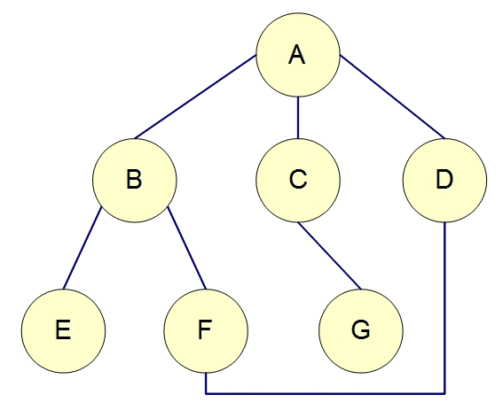

# 深度優先搜尋法(Depth-first Search,DFS)

是一種用來遍尋一個樹(tree)或圖(graph)的演算法。由樹的根(或圖的某一點當成 根)來開始探尋，先探尋邊(edge)上未搜尋的一節點(vertex or node)，並儘可能深的搜索，直到該節點的所有邊上節點都已探尋；就回溯(backtracking)到前一個節點，重覆探尋未搜尋的節點，直到找到目的節點或遍尋全部節點。
(通常以遞迴的方式呈現)

# 廣度優先搜尋法

是一種圖形(graph)搜索演算法。從圖的某一節點(vertex, node)開始走訪，接著走訪此一節點所有相鄰且未拜訪過的節點，由走訪過的節點繼續進行先廣後深的搜尋。以樹(tree)來說即把同一深度(level)的節點走訪完，再繼續向下一個深度搜尋，直到找到目的節點或遍尋全部節點。
(通常以迴圈的方式呈現)

# A*搜尋演算法(自行額外補充)
A*搜尋演算法（A* search algorithm）是一種在圖形平面上，有多個節點的路徑，求出最低通過成本的演算法。常用於遊戲中的NPC的移動計算，或網路遊戲的BOT的移動計算上。

該演算法綜合了最良優先搜尋和Dijkstra演算法的優點：在進行啟發式搜尋提高演算法效率的同時，可以保證找到一條最佳路徑（基於評估函式）。

在此演算法中，如果以{\displaystyle g(n)}g(n)表示從起點到任意頂點{\displaystyle n}n的實際距離，{\displaystyle h(n)}h(n)表示任意頂點{\displaystyle n}n到目標頂點的估算距離（根據所採用的評估函式的不同而變化），那麼A*演算法的估算函式為：

{\displaystyle f(n)=g(n)+h(n)}{\displaystyle f(n)=g(n)+h(n)}

{\displaystyle h(n)}h(n)為評估函式，見的評估函式有——歐幾里得距離、曼哈頓距離、切比雪夫距離。

## 參考資料
[深度優先搜尋法](http://simonsays-tw.com/web/DFS-BFS/DepthFirstSearch.html) \
[廣度優先搜尋法](http://simonsays-tw.com/web/DFS-BFS/BreadthFirstSearch.html)
